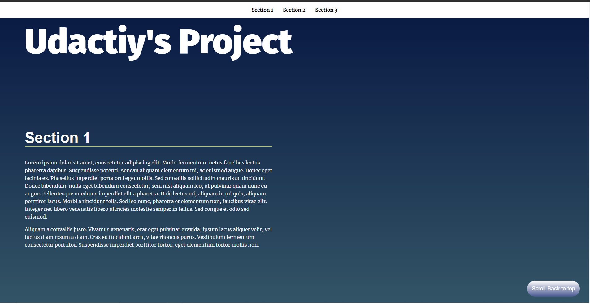

# Landing Page Project

## Table of Contents

* Html and css mostly from udacity's startup project but i did some changes
* use Dom to generate a navbar 
* smooth scroll with css
* add a scroll to top button
* add and remove active class when scrolling through the sections 

## sources i used 

* https://www.w3schools.com/howto/howto_js_scroll_to_top.asp
* https://developer.mozilla.org/en-US/docs/Glossary/Viewport
* https://developer.mozilla.org/en-US/docs/Web/API/Element/getBoundingClientRect

